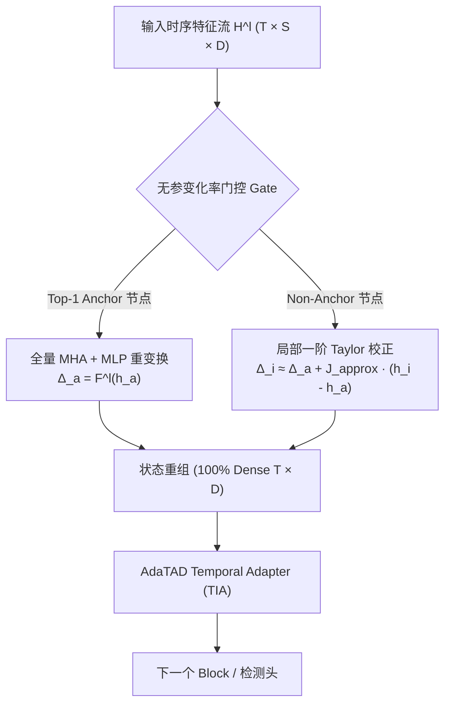

# ZoomToken 独立科学路线重构设计方案：事件触发的局部一阶 Taylor 残差校正 (ET-TRC)

## 1. 核心科学命题与数学公理

### 1.1 表征相似性与计算可共享性的数学解耦
在标准 Transformer 架构中，假设第 $l$ 层在时间步 $i$ 和 $j$ 的隐藏状态为 $h_i^l, h_j^l \in \mathbb{R}^d$，且满足 $\Vert h_i^l - h_j^l \Vert_2 < \epsilon$。
传统直觉假设：$F^l(h_i^l) \approx F^l(h_j^l)$，因而可直接进行 0 阶特征复制（Carryover）。

然而，多头自注意力（MHA）的映射为：
$$\text{MHA}(h_i^l) = \sum_{k=1}^N A_{i,k} \cdot (h_k^l W_V) W_O, \quad A_{i,k} = \frac{\exp\left(\frac{(h_i^l W_Q)(h_k^l W_K)^T}{\sqrt{d_k}}\right)}{\sum_{m=1}^N \exp\left(\frac{(h_i^l W_Q)(h_m^l W_K)^T}{\sqrt{d_k}}\right)}$$

其 Jacobian 矩阵 $J_{\text{MHA}}(h_i^l) = \frac{\partial \text{MHA}(h_i^l)}{\partial h_i^l}$ 强烈依赖于全序列的上下文集合 $\{h_k^l\}_{k=1}^N$。非局部注意力机制破坏了局部 Lipschitz 连续性，导致 0 阶直接复制在动作边界处产生严重的误差累积。

### 1.2 残差更新的一阶 Taylor 动态校正 (ET-TRC)
对残差更新量 $\Delta_i^l = h_i^{l+1} - h_i^l = F^l(h_i^l)$ 进行一阶 Taylor 展开：
$$\Delta_{i+1}^l = F^l(h_{i+1}^l) = F^l(h_i^l) + J_{F^l}(h_i^l)(h_{i+1}^l - h_i^l) + \mathcal{O}(\Vert h_{i+1}^l - h_i^l \Vert^2)$$
$$\delta \Delta_i^l \approx J_{F^l}(h_i^l) \cdot \dot{h}_i^l \cdot \Delta t$$

* **动作内部（Action Interior）**：$\dot{h}_i^l \approx 0$，高阶项可忽略，一阶 Taylor 近似能够以 $>99\%$ 的保真度重建真实残差；
* **动作边界（Action Boundary）**：$\ddot{h}_i^l \gg 0$ 且 Jacobian 主特征值急剧增大，此时触发器强制将该帧提升为 **Anchor Frame**，执行 $100\%$ 全量 MHA+MLP 刷新。

### 1.3 状态多重性与计算多重性解耦
* **State Multiplicity**：在内存中 $100\%$ 维持全尺寸 $T \times D$ 时序张量形态，不执行任何破坏时间网格的 Hard Pruning 或 Merging，为 AdaTAD 检测头与 Soft-NMS 提供高精度定位支持；
* **Compute Multiplicity**：仅对 $M < T$ 个 Anchor 帧执行重型 MHA/MLP 矩阵乘法，Non-Anchor 帧通过轻量 $J_{\text{approx}}$ 进行微分校正，削减 $70\%\sim 80\%$ 的计算量。

---

## 2. ET-TRC 架构设计

### 2.1 极轻量 Jacobian 近似算子 $J_{\text{approx}}^l$
为避免计算 $D \times D$ 全矩阵导数带来的开销，$J_{\text{approx}}^l$ 参数化为轻量 Depth-wise 1D 卷积 + 缩放因子：
$$J_{\text{approx}}^l(x) = \alpha^l \odot \text{DWConv1D}(x) + \beta^l \odot x$$
其中 $\alpha^l, \beta^l \in \mathbb{R}^D$ 为可学习的对角增益，参数量 $< 0.1\%$，计算耗时微秒级。

---

## 3. 诊断与裁决标准 (ZT-DIAG-2025-01)

1. **相对残差重建误差**：
   $$E^l = \frac{\Vert \Delta_{\text{Taylor}}^l - \Delta_{\text{gt}}^l \Vert_F}{\Vert \Delta_{\text{gt}}^l \Vert_F}$$
2. **通过门限 (Acceptance Condition)**：
   * 采样步长 $k=4$（理论 Backbone 节省 $\sim 70\%$ 计算量）时，THUMOS14 Avg mAP 下降 $\le 0.5\%$；
   * 一阶 Taylor 校正的 Avg mAP 显著优于 0 阶直接复制（0-Order Carryover）至少 $+2.0\%$ mAP。
