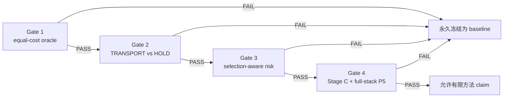

# ChronoTransport CT-P3R-3S 有界上诉与完整验证规格

日期：2026-07-11

协议编号：`CT-P3R-3S`

决策状态：对话中已批准进入正式规格；等待书面规格复核后实施

实现状态：旧 P3 已完成并失败；本协议修复尚未实施

实验状态：`designed`，不是 `tested`、`experiment_running` 或 `empirically_supported`

## 1. 裁决背景

ChronoTransport 当前 seed-3407 P3 不是“结果不够漂亮”，而是正式 science gate
失败：

- evaluation 上 risk-regret Spearman 为 `-0.1914`；
- calibration/evaluation 把同一窗口的多个 candidate row 当作独立样本，不能证明
  scheduler 选择后的 coverage；
- 当前 risk head 先对 144 个 `chunk × layer-group` cell 分别输出非负值，再求和，
  对窗口级 regret 产生约两个数量级的系统性高估；
- `periodic2_transport` 相对 matched HOLD 的 detector-regret improvement CI 为正，
  但 feature-MSE improvement CI 跨 0；
- measured full-stack cost 尚未 ready，Stage C/P5 没有解锁。

因此，当前 cell-sum risk 实现和 seed-3407 checkpoint 已被否定；更宽的
ChronoTransport 假设族尚未被完全否定。它只获得本协议规定的一次有界上诉。任何
gate 失败后，路线永久降级为工程 baseline，不再更换 risk head、loss、权重、候选库
或 seeds 重试。

## 2. 要回答的四个科学问题

- H1：在相同实测成本预算下，不同离线视频窗口是否真的需要不同的
  `time × depth` 重算计划？
- H2：在完全相同的重算 mask 下，学习到的 TRANSPORT 是否稳定优于 HOLD？
- H3：仅使用部署可见信号，是否能排序并校准窗口级 detector regret，从而支持实际
  scheduler 选择？
- H4：通过 H1–H3 后，完整系统是否在保护高 tIoU 与短动作的同时获得真实净加速？

四个问题必须按 Gate 1 → Gate 2 → Gate 3 → Gate 4 顺序回答。前一道 gate 失败时，
后续 gate 不运行。

## 3. 不变合同与唯一允许修改

### 3.1 必须冻结

- 离线全窗口任务定义；不得称 Online/causal TAD。
- 输入 768 帧、48 个 16-frame clip、384 点内部 tubelet grid、768 点 detector grid。
- 三个连续层组 `[0:4] / [4:8] / [8:12]`；调度单位仍为
  `48 clips × 3 layer groups`，不是逐帧或逐 token routing。
- dense patch embedding、每 block 后的 AdaTAD temporal adapter、projection、head、
  NMS 和外部时间几何。
- `RECOMPUTE / TRANSPORT / HOLD` 动作、anchor/latest/age cache 语义、首 clip
  强制 RECOMPUTE、非法状态 fail closed。
- `TemporalTransportAdapter` 的结构；TRANSPORT 继续从 latest 链式递推。允许每个
  seed 按相同 Stage-B 协议学习 transport 参数，但不得改变其层数、宽度、输入或 loss。
- 部署信号白名单：energy、delta L2、pooled L2、cosine change、normalized chunk
  position、finite flag，加候选 action、group identity 与 deterministic cache age。
- 禁止 validation/test GT、teacher、dense heavy reference、raw prediction cache、
  counterfactual ledger 进入推理决策。
- Stage-B optimizer 与权重：AdamW，LR `1e-4`，weight decay `0`，
  `lambda_transport=0.1`，`lambda_risk=0.1`，EMA `0.999`，gradient clip `1.0`；
  每 seed 仅 1 个 fit epoch。
- 风险分位数 `tau=0.9`、scheduler risk tolerance `epsilon=1.0`。
- seeds 固定为 `3407 / 3408 / 3409`，不得以额外 seed 上诉。

### 3.2 唯一允许的模型修复

只把 risk predictor 从“144 个非负 cell risk 求和”替换为一个窗口级、候选
schedule-conditioned quantile head。不得并行试验第二种 pooling、head、loss 或
normalization。

对每个 cell，输入仍为：

`[deploy-visible signal, action embedding, group embedding, normalized age]`。

唯一 head 定义如下：

1. cell encoder：`Linear(D,64) → GELU → Linear(64,64) → GELU`；
2. 在全部 48×3 cell 上分别做 mean pooling 与 max pooling；不使用可调 mask 或额外
   pooling normalization；
3. 拼接为 128 维窗口表示；
4. scalar head：`LayerNorm(128) → Linear(128,64) → GELU → Linear(64,1) → Softplus`；
5. 输出一个非负窗口级预测 `q_hat_tau(x,s)`，不再对 cell scalar 求和。

target 保持原始单侧 detector regret：

`r(x,s) = max(L_detector(x,s) - L_detector(x,dense), 0)`。

训练继续使用 `tau=0.9` pinball loss。dense schedule 的 regret/upper risk 固定为 0，
不参与 risk-head 拟合。

## 4. 固定数据、checkpoint 与随机性

- 使用同一个已登记的 AdaTAD/VideoMAE-S dense checkpoint 作为三个 seed 的共同起点；
  启动 manifest 必须记录本地路径、远端路径和 SHA-256。
- 由 seed `3407` 一次性构造并冻结 THUMOS14 train-video manifest，比例为
  fit/calibration/evaluation=`140/30/30`。seeds 3408/3409 复用同一个 manifest，seed
  只控制参数初始化、loader RNG 与 matched-random schedule。
- fit 只用于训练；calibration 只用于 cost-matched baseline 选择、motion threshold 和
  conformal offset；evaluation 只用于 Gate 1–3 的一次性裁决。
- Gate 1–3 的 evaluation labels 不得反向进入任何模型、阈值、candidate library 或部署
  选择；仅允许 Gate 1 的 diagnostic oracle 与保守的 evaluation-best static comparator
  在裁决脚本内部读取它们。
- Gate 4 使用官方 detector validation/test protocol；GT 只在模型输出落盘后用于离线
  metric 计算，不进入 scheduler。
- 同一 `sample_id × seed × schedule` 的 dense/counterfactual replay 必须使用同 batch、
  同 augmentation 与同 RNG state。

## 5. 固定 schedule 与控制库

所有固定 schedule 的第 0 个 clip、三个层组均为 RECOMPUTE。

### 5.1 可训练、可被 risk scheduler 选择的固定库

- `dense`：全部 RECOMPUTE，仅作为 fail-closed candidate。
- `periodic2_transport / periodic4_transport / periodic8_transport`：三个层组分别每
  2/4/8 个 clip 同步 RECOMPUTE，其余为 TRANSPORT。
- `periodic2_hold / periodic4_hold / periodic8_hold`：与对应 TRANSPORT 完全相同的
  RECOMPUTE mask，其余为 HOLD。
- `hold_only / transport_only`：除首 clip 外全部 HOLD 或 TRANSPORT。
- `layer_only_early_recompute / layer_only_early_recompute_hold`：早层组每 clip
  RECOMPUTE，中/晚层组除首 clip 外分别为 TRANSPORT/HOLD。
- `layer_only_late_recompute / layer_only_late_recompute_hold`：晚层组每 clip
  RECOMPUTE，早/中层组除首 clip 外分别为 TRANSPORT/HOLD。
- `joint_progressive_transport / joint_progressive_hold`：早/中/晚层组周期分别为
  8/4/2，其余 cell 分别为 TRANSPORT/HOLD。
- `joint_reverse_transport / joint_reverse_hold`：早/中/晚层组周期分别为 2/4/8，
  其余 cell 分别为 TRANSPORT/HOLD。

Gate 1 只使用上述 HOLD 版本来隔离“重算位置价值”；通过后，Stage-B 才在上述 16 个
非 dense 固定 schedule 间严格 round-robin，1 epoch 共 140 个 optimizer steps。固定
顺序为 P2-T/P2-H、P4-T/P4-H、P8-T/P8-H、transport-only/hold-only、early-T/H、
late-T/H、progressive-T/H、reverse-T/H，不按 evaluation 结果重排。

### 5.2 只作非学习控制的动态/随机基线

- `motion_p{2,4,8}`：仅用 deploy-visible cosine-change signal；在 calibration split
  上用不看标签的 quantile threshold，使每层组 RECOMPUTE 数与相应 periodic mask
  相同，然后冻结 threshold；其余 cell 为 HOLD。
- `random_p{2,4,8}`：首 clip 固定后，以
  `SHA256(sample_id, seed, group, period)` 决定位置；每层组 RECOMPUTE 数与相应
  periodic mask 完全相同，其余 cell 为 HOLD。
- `uncalibrated_risk`：同一个训练后 head，conformal offset 强制为 0。
- `oracle`：可访问 evaluation regret，仅作诊断，永不进入 checkpoint、scheduler 或
  主方法结果。

candidate library、顺序、动作矩阵和 hash 必须写入 manifest 并计算 SHA-256。任何运行
时 library hash 不一致都 fail closed。

## 6. 实测成本合同

Gate 1 前先在物理 GPU1 上建立 schedule-shape cost lookup。正式配置为 batch size 1、
AMP FP16；每个 schedule 先 warm-up 50 次，再至少计时 200 个窗口，CUDA 同步。必须
记录 p50/p95、peak memory 和以下阶段：

- data/decode；
- preprocess；
- H2D；
- innovation signal；
- scheduler；
- heavy RECOMPUTE；
- TRANSPORT；
- cache movement；
- dense AdaTAD adapter；
- neck/head；
- postprocess。

lookup key 固定包含 hardware、precision、batch_size、candidate_schedule、
selected_rows_per_group；缺 key、非有限值、环境 fingerprint 不一致时只允许 dense。
线性 action-cost estimate 只可用于 unit test，不可用于任一 gate。

主成本预算固定为：

`B* = measured full-stack p50(periodic4_transport)`。

Gate 1 和 Gate 4 的 cost-matched 比较只允许使用 measured p50 不高于 `B*` 的 candidate；
不得在看到 evaluation 结果后改成 P2 或 P8 预算。

## 7. Gate 1：equal-cost oracle feasibility

Gate 1 在训练新 risk head 或新 transport seed 之前运行。对每个 evaluation 窗口 replay
固定库中的 HOLD schedules 和 HOLD-based controls，并计算 detector regret、
endpoint/high-IoU proxy、short-action proxy、feature MSE 和实测 schedule cost。这样
H1 只检验重算 mask 的窗口依赖价值，不与 TRANSPORT 的学习质量混淆。

在预算 `B*` 下定义：

- joint oracle：逐窗口在全部可行 HOLD schedule 中选择最低 detector regret；
- time-only oracle：逐窗口只在 P2/P4/P8 HOLD 中选择；
- layer-only oracle：逐窗口只在两个 layer-only HOLD schedule 中选择；
- evaluation-best global static：在全部可行 HOLD schedule 中取 evaluation 平均 regret
  最低者。这里
  故意允许它看 evaluation，以形成对 joint oracle 更保守的上界比较；
- motion/random control：取对应预算下最强的冻结控制。

`best_comparator` 是 time-only oracle、layer-only oracle、evaluation-best global static、
motion 和 random 中平均 regret 最低者。Gate 1 必须同时满足：

1. joint oracle 相对 `best_comparator` 的平均 detector-regret 降幅至少 10%；
2. paired window bootstrap 的绝对 improvement 95% CI 下界大于 0；
3. 保持每个窗口 cost-feasible 后，将 joint-oracle 选择的 schedule 在窗口间置乱 5000
   次；真实 window/schedule pairing 相对 shuffled pairing 的 regret improvement 95%
   CI 下界大于 0；
4. `B*` 相对 dense 的 measured full-stack p50 saving 至少 20%。

四项任一失败即判 H1=`no`，整个 ChronoTransport 路线结束；不训练新 risk head 或
新的 transport seeds。

## 8. Gate 2：matched TRANSPORT vs HOLD mechanism

三个 seeds 分别训练同结构 transport/risk，但 Gate 2 只比较相同重算 mask：

- P2 TRANSPORT vs P2 HOLD；
- P4 TRANSPORT vs P4 HOLD；
- P8 TRANSPORT vs P8 HOLD。

对每个 `seed × sample_id × period` 计算：

- detector improvement = `regret_hold - regret_transport`；
- feature improvement = `mse_hold - mse_transport`。

Gate 2 必须同时满足：

1. 三 period、三 seed pooled detector regret 相对下降至少 5%；
2. detector improvement 的 paired hierarchical-bootstrap 95% CI 下界大于 0；
3. feature improvement 的 paired hierarchical-bootstrap 95% CI 下界大于 0；
4. 每个 seed 的 detector 与 feature mean improvement 均不得小于 0。

`hold_only / transport_only` 结果必须报告但不作为替代 gate。任一主条件失败即判
H2=`no`，不得通过修改 transport loss、结构或训练时长再试。

## 9. Gate 3：窗口级风险与 selection-aware calibration

### 9.1 拟合与强基线

每 seed 在 fit split 训练唯一窗口级 quantile head。constant baseline 不是一个全局
常数，而是每个 schedule 分别用 fit target 的经验 0.9 quantile；这比全局常数更强。

### 9.2 simultaneous、selection-safe 校准

在 calibration split 上，对每个窗口 `i` 计算：

`score_i = max_s max(r_i,s - q_hat_i,s, 0)`，

其中 `s` 遍历全部非 dense schedulable candidates。以 30 个窗口 score 的 finite-sample
0.9 split-conformal quantile作为唯一 offset `q_conf`。于是同一窗口内所有候选同时拥有
upper bound：

`upper_i,s = q_hat_i,s + q_conf`。

实际 scheduler 在 measured p50 不高于 `B*` 的 candidates 中，选择满足
`upper_i,s <= epsilon=1.0` 的最低成本项；无可行项、非有限值、OOD 或 metadata/hash
不一致时选择 dense。不能先对所有 candidate rows 校准，再另行评估选择后 coverage。

### 9.3 Gate 条件

evaluation 上必须同时满足：

1. 每 seed 的 candidate-row Spearman 均不小于 0，三 seed median 至少 0.2；
2. pooled Spearman 的 hierarchical-bootstrap 95% CI 下界大于 0；
3. 汇总三 seed 后，在实际选择为非 dense 的窗口上，`upper >= regret` 的
   selection-aware coverage 落在 `[0.85, 0.95]`；同时逐 seed 报告该 coverage，并报告
   含 dense fallback 的 all-window coverage；
4. 窗口级 head 的 evaluation pinball loss 至少比 schedule-conditioned constant
   quantile baseline 低 10%；
5. calibrated scheduler 在至少 20% evaluation 窗口选择非 dense；
6. offset=0 的 uncalibrated scheduler、calibrated scheduler 与 dense fallback 的选择率
   和 regret 必须并列报告。

coverage 高于 0.95 也视为失败，因为它与低非 dense 选择一起可能只是保守过度估计。
任一条件失败即判 H3=`no`；不得再换 attention pooling、MLP 宽度、target
normalization、quantile、epsilon 或 loss。

## 10. 统计协议

- Gate 1 使用 5000 次 paired window bootstrap，以 `sample_id` 为不可拆分 cluster；
  它发生在新三-seed训练前，不伪造重复 seed。Gate 2–4 使用 5000 次 paired
  hierarchical bootstrap：先对三个 seeds 有放回采样，再在每个 seed 内对
  `sample_id` 有放回采样；同一 sample 的所有 schedule/period 行必须一起移动，禁止
  把 candidate rows 当作独立样本。
- CI 为 percentile 95% interval；随机数种子固定 `20260711`。
- relative improvement 的 denominator 固定为 comparator mean，并以 `1e-12` 防零；
  同时报告 absolute difference，gate 的 CI 条件用 absolute difference。
- Gate 1 的 shuffled test 使用同一 5000 次预注册置乱，置乱仅发生在同成本可行集合内。
- 每项 gate 输出 numerator、denominator、point estimate、CI、样本窗口数、seed 数、
  缺失/非有限记录数和布尔裁决。缺记录或非有限值直接 FAIL，不得静默丢弃。

## 11. Gate 4：Stage C 与完整 P5

Gate 1–3 全部 PASS 后才创建 Stage-C unlock artifact。Stage C 保持 VideoMAE heavy
blocks 冻结，只训练现有 AdaTAD adapters、transport 与同一个 risk head；沿用官方 base
config 的 60 epoch workflow、optimizer/scheduler、AMP 和三个 seeds，不做超参搜索。
训练只读 fit split。Stage C 完成后必须在 calibration split 用第 9 节同一方法重新计算
offset，并重新满足 Gate 3 的全部条件，才可做 learned scheduler 推理。

同时训练 matched dense Stage-C control：相同起点、seed、fit windows、optimizer steps、
AdaTAD adapter trainability 和 detector task loss，forced dense；它不训练 transport/risk，
用于排除额外 adapter exposure 带来的比较偏差。

P5 基线固定为：

- 原始 dense checkpoint 与 matched dense Stage-C control；
- calibration 上冻结的 best global static；
- P2/P4/P8 TRANSPORT 与 matched HOLD；
- layer-only 与两种 joint schedule；
- motion/innovation 与 matched random；
- uncalibrated risk；
- calibrated risk；
- diagnostic-only oracle。

calibrated scheduler 必须同时满足：

1. 相对 matched dense control 的 full-stack p50 latency saving 至少 15%；
2. mAP@0.7 下降不超过 1.5 absolute；最短 GT-duration quartile 的 mAP@0.7 下降不超过
   1.5 absolute；Avg-mAP、mAP@0.3–0.7 与其余 duration quartiles 同时完整报告；
3. `innovation + scheduler + transport + cache movement` 额外 p50 overhead 不超过
   `dense heavy recompute p50 - selected heavy recompute p50` 的 40%；
4. 在同一 `B*` 成本预算下，calibrated scheduler 相对 calibration 冻结的 best global
   static 具有更低 evaluation detector regret，paired hierarchical-bootstrap 95% CI
   下界大于 0，且 full-stack p50 不高于该 static baseline；
5. 三个 seeds 的 latency、mAP@0.7 与 shortest-quartile 结果均不出现超过上述阈值的
   单 seed 反转。

同时报告 p95 latency、peak memory、GPU energy、吞吐与各阶段 cost breakdown。GPU
energy 使用 NVML 10 Hz power sampling 对同一计时区间做梯形积分；它们不替代五项
primary gate。任一失败即判 H4=`no` 并永久冻结路线。

## 12. 工程与远端执行合同

- 本地只做静态、unit、focused integration 与 launcher precheck；所有真实 GPU 行为
  验证、replay、训练、校准、profiling 和 detector evaluation 均在远端完成。
- 远端写入限定 `/data/run01/sczc063/yuzibo`（等价 `~/run/yuzibo`）。
- 环境固定：CUDA 11.8、miniforge 24.11、
  `/data/run01/sczc063/yuzibo/conda_envs/opentad`。
- 只允许物理 GPU1；launcher 必须在 `CUDA_VISIBLE_DEVICES=1` 时继续，且必须位于
  Slurm allocation/step 或已授权的 protected allocation，不能在登录节点直接训练。
- 每个正式 launcher 先执行 `PRECHECK_ONLY=1`；validator 必须验证 commit、dirty
  state、config/checkpoint/library/split/cost hashes、单可见 GPU、输出根和 unlock chain。
- 任一进程必须可 resume，原子写 checkpoint/report，并以 `SUCCESS/FAIL/STOPPED` marker
  区分完成、科学失败与基础设施中断。基础设施中断可从同 checkpoint 恢复，不计作第二
  科学上诉；改变模型或协议则计作违规。

## 13. 产物与泄漏边界

远端 run root 固定形如：

`/data/run01/sczc063/yuzibo/chronotransport_runs/ct_p3r_3s/<commit>/`。

共享 Gate-1 replay/profile/report 放在 `shared/gate1/`；Gate 1 通过后，每个 seed 的训练与
裁决产物放在 `<seed>/`。完整 run 至少产生：

- `run_manifest.json`；
- `split_manifest.json` 与 library/cost hashes；
- `profile.json` 和 nonlinear cost lookup；
- fit metrics、trained checkpoint、calibrated checkpoint；
- calibration/evaluation compact ledgers；
- Gate 1–4 machine-readable reports（只生成实际解锁并运行的 gates）；
- official detector metrics 与 duration-stratified metrics；
- stdout/stderr launcher log 和 final marker。

compact ledger 只允许 sample id、split、schedule、deploy-visible pooled signals、成本、
pooled targets、regret 和 feature MSE。不得持久化 raw detector predictions 或 full-token
state；official metric 所需 prediction 文件必须与 scheduler 输入隔离，并明确标记
`evaluation_only=true`。

## 14. Claim 解锁与停止纪律

初始 claim flags 全部为 false：`mechanism / calibrated_risk / metric / latency / deploy /
paper`。Gate 1 只证明 oracle feasibility；Gate 2 只允许 mechanism flag；Gate 3 只允许
calibrated-risk flag；Gate 4 全部通过后，才允许在 AdaTAD/THUMOS14/物理 GPU1 范围内
打开 metric 与 latency claim。即便通过，也不得声称首次提出 time×depth 动态计算、
MoD、三动作 cache 或 conformal control。

失败报告是正式结果：必须更新 research-wiki experiment/claim/anti-repetition 节点，
保留原始 machine report，并把 ChronoTransport 标记为 `negative_gate / frozen_baseline`。
禁止删除负结果、改 gate、补 seed 或从同一结果中挑选另一个预算复活路线。

## 15. 完成定义

- 规格完成：本文件通过书面复核，无占位符、未定义阈值或隐含调参自由度。
- 实现完成：focused tests、validator、runner、统计汇总、Stage-C/P5 launcher 全部落地；
  只表示 `implemented`。
- 部署完成：三个 seeds 的正式 job 已在 GPU1 启动并登记 job/run root；只表示
  `experiment_running`。
- 科学完成：按顺序执行到首个 FAIL，或 Gate 1–4 全部 PASS，并把原始结果、裁决和
  claims 写回 research-wiki。只有后一种情况可称 `empirically_supported`；论文级叙事
  仍需独立新颖性与外部复核。
