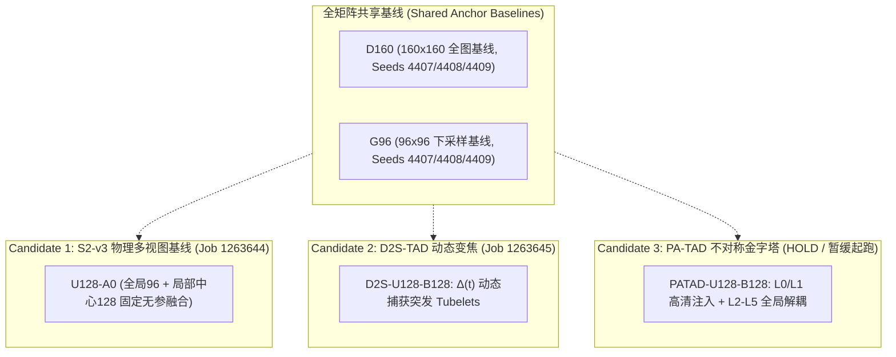

# ZoomToken CVPR 2027 全量实验跟踪账本 (Experiment Tracking Ledger)

> **当前裁决状态**: `REVISE` (全量数据与准确率训练继续保留；所有 efficiency / Pareto 主张标记为 `UNVERIFIED`，待算子级对账核验)  
> **最后更新时间**: 2026-09-01 16:32 (UTC+8)  
> **远程集群环境**: 国家超级计算中卫节点 (BSCC-N16R4), 节点 GPU: NVIDIA GeForce RTX 4090 (24GB)  
> **统一数据规模**: THUMOS14 完整 200 训练视频 (无截断, 60 Epochs, 100 Updates/Epoch, 6,000 Updates/Cell) + 211 验证视频 (792 顺序滑动窗口)  
> **代码分支**: [`codex/zoomtoken-s2-v3-full200-compute-rpl1-v001`](https://github.com/yuzbo/OpenTAD_C3_CoarseClean_20260702/tree/codex/zoomtoken-s2-v3-full200-compute-rpl1-v001)  
> **远端部署路径**: `/data/run01/sczc063/yuzibo/projects/zoomtoken_s2_v3_rpl1_2c8f25fe_src`

---

## 一、 实验矩阵总览与实时状态

| 序号 | 实验阶段 / 名称 | 协议 ID | 实验臂 (Arms) 与种子 (Seeds) | 核心机制与算力状态 | Slurm Job ID | 当前状态 | 产出目录与日志 |
| :---: | :--- | :--- | :--- | :--- | :---: | :---: | :--- |
| **1** | **Phase 1: S2-v3 物理多视图基线矩阵** | `ZOOMTOKEN-CONTINUOUS-ROI-S2-V3-FULL200-COMPUTE-PARETO-3X3-v001` | • `D160` (4407, 4408, 4409) • `G96` (4407, 4408, 4409) • `U128-A0` (4407, 4408, 4409) *(共 9 个 Cells)* | 全局 96 + 局部中心 128 原生源裁剪；单 VideoMAE 共享；零参数固定均值融合。 🟢 **已实装边训边测 (每5轮评估)** | **`1264289`** | 🟢 **RUNNING** (Node `g0015`) | `/data/run01/sczc063/yuzibo/projects/continuous_roi_s2_v3_full200_compute` `slurm_1264289.log` |
| **2** | **Phase 2: D2S-TAD 动态双速变焦矩阵** | `ZOOMTOKEN-D2S-TAD-FULL200-COMPUTE-PARETO-3X3-v001` | • `D160` (4407, 4408, 4409) • `G96` (4407, 4408, 4409) • `D2S-U128-B128` (4407, 4408, 4409) *(共 9 个 Cells)* | 一阶时序语义变化率 $\Delta(t)$ 动态触发（仅由全局 Scout 特征计算，严格前因果）；无参掩码注入。 🟢 **已实装边训边测 (每5轮评估)** | **`1264290`** | 🟢 **RUNNING** (Node `g0015`) | `/data/run01/sczc063/yuzibo/projects/d2s_tad_full200_compute` `slurm_1264290.log` |
| **3** | **Phase 3: PA-TAD 不对称金字塔分发矩阵** | `ZOOMTOKEN-PATAD-FULL200-COMPUTE-PARETO-3X3-v001` | • `D160` (4407, 4408, 4409) • `G96` (4407, 4408, 4409) • `PATAD-U128-B128` (4407, 4408, 4409) *(共 9 个 Cells)* | 低层金字塔 $L_0, L_1$ 注入高密局部突发特征；高层 $L_2 \sim L_5$ 直接由全局 96 特征下采样。 `ρ_C`: **UNVERIFIED** (暂缓起跑) | - | ⏸️ **HOLD** (待 Phase 1/2 审查后放行) | `/data/run01/sczc063/yuzibo/projects/patad_full200_compute` |

---

## 二、 详细实验配置与代码映射表

### 1. Phase 1: S2-v3 物理多视图基线
* **协议文件**: [`docs/methods/continuous_roi_s2_v3_full200_compute_protocol.json`](file:///E:/DeskTop/TAD/OpenTAD_ZoomToken_CVPR2027/docs/methods/continuous_roi_s2_v3_full200_compute_protocol.json)
* **核心模型代码**:
  * 图像变换: [`opentad/datasets/transforms/native_crop.py`](file:///E:/DeskTop/TAD/OpenTAD_ZoomToken_CVPR2027/opentad/datasets/transforms/native_crop.py) (`NativeCropSourceViews`)
  * 骨干包装器: [`opentad/models/backbones/native_crop_wrapper.py`](file:///E:/DeskTop/TAD/OpenTAD_ZoomToken_CVPR2027/opentad/models/backbones/native_crop_wrapper.py) (`NativeCropBackboneWrapper`)
* **配置文件**:
  * D160: [`continuous_roi_s2_v3_d160_seed4407.py`](file:///E:/DeskTop/TAD/OpenTAD_ZoomToken_CVPR2027/configs/adatad/thumos/continuous_roi_s2_v3_d160_seed4407.py), `seed4408.py`, `seed4409.py`
  * G96: [`continuous_roi_s2_v3_g96_seed4407.py`](file:///E:/DeskTop/TAD/OpenTAD_ZoomToken_CVPR2027/configs/adatad/thumos/continuous_roi_s2_v3_g96_seed4407.py), `seed4408.py`, `seed4409.py`
  * U128-A0: [`continuous_roi_s2_v3_u128_a0_seed4407.py`](file:///E:/DeskTop/TAD/OpenTAD_ZoomToken_CVPR2027/configs/adatad/thumos/continuous_roi_s2_v3_u128_a0_seed4407.py), `seed4408.py`, `seed4409.py`
* **执行与调度脚本**:
  * Launcher: [`scripts/run_zoomtoken_continuous_roi_s2_v3_full200_compute_n16r4.sh`](file:///E:/DeskTop/TAD/OpenTAD_ZoomToken_CVPR2027/scripts/run_zoomtoken_continuous_roi_s2_v3_full200_compute_n16r4.sh)
  * Sbatch: [`scripts/submit_zoomtoken_s2_v3_full200_compute_n16r4.sbatch`](file:///E:/DeskTop/TAD/OpenTAD_ZoomToken_CVPR2027/scripts/submit_zoomtoken_s2_v3_full200_compute_n16r4.sbatch)
* **GitHub 对应链接**:
  * [Branch Code](https://github.com/yuzbo/OpenTAD_C3_CoarseClean_20260702/tree/codex/zoomtoken-s2-v3-full200-compute-rpl1-v001)
  * [U128-A0 Config](https://github.com/yuzbo/OpenTAD_C3_CoarseClean_20260702/blob/codex/zoomtoken-s2-v3-full200-compute-rpl1-v001/configs/adatad/thumos/continuous_roi_s2_v3_u128_a0_seed4407.py)

---

### 2. Phase 2: D2S-TAD 动态双速变焦
* **协议文件**: [`docs/methods/d2s_tad_full200_compute_protocol.json`](file:///E:/DeskTop/TAD/OpenTAD_ZoomToken_CVPR2027/docs/methods/d2s_tad_full200_compute_protocol.json)
* **核心模型代码**:
  * 动态突发变焦骨干: [`opentad/models/backbones/d2s_videomae_wrapper.py`](file:///E:/DeskTop/TAD/OpenTAD_ZoomToken_CVPR2027/opentad/models/backbones/d2s_videomae_wrapper.py) (`D2STemporalZoomBackboneWrapper`)
* **配置文件**:
  * D2S-U128-B128: [`continuous_roi_d2s_v3_u128_burst128_seed4407.py`](file:///E:/DeskTop/TAD/OpenTAD_ZoomToken_CVPR2027/configs/adatad/thumos/continuous_roi_d2s_v3_u128_burst128_seed4407.py), `seed4408.py`, `seed4409.py`
* **执行与调度脚本**:
  * Launcher: [`scripts/run_zoomtoken_d2s_tad_full200_compute_n16r4.sh`](file:///E:/DeskTop/TAD/OpenTAD_ZoomToken_CVPR2027/scripts/run_zoomtoken_d2s_tad_full200_compute_n16r4.sh)
  * Sbatch: [`scripts/submit_zoomtoken_d2s_tad_full200_compute_n16r4.sbatch`](file:///E:/DeskTop/TAD/OpenTAD_ZoomToken_CVPR2027/scripts/submit_zoomtoken_d2s_tad_full200_compute_n16r4.sbatch)
* **GitHub 对应链接**:
  * [D2S Backbone Wrapper](https://github.com/yuzbo/OpenTAD_C3_CoarseClean_20260702/blob/codex/zoomtoken-s2-v3-full200-compute-rpl1-v001/opentad/models/backbones/d2s_videomae_wrapper.py)
  * [D2S Config](https://github.com/yuzbo/OpenTAD_C3_CoarseClean_20260702/blob/codex/zoomtoken-s2-v3-full200-compute-rpl1-v001/configs/adatad/thumos/continuous_roi_d2s_v3_u128_burst128_seed4407.py)

---

### 3. Phase 3: PA-TAD 金字塔感知不对称分发
* **协议文件**: [`docs/methods/patad_full200_compute_protocol.json`](file:///E:/DeskTop/TAD/OpenTAD_ZoomToken_CVPR2027/docs/methods/patad_full200_compute_protocol.json)
* **核心模型代码**:
  * 不对称金字塔投影: [`opentad/models/projections/pyramid_aware_asymmetric_proj.py`](file:///E:/DeskTop/TAD/OpenTAD_ZoomToken_CVPR2027/opentad/models/projections/pyramid_aware_asymmetric_proj.py) (`PyramidAwareAsymmetricProj`)
* **配置文件**:
  * PATAD-U128-B128: [`continuous_roi_patad_v3_u128_seed4407.py`](file:///E:/DeskTop/TAD/OpenTAD_ZoomToken_CVPR2027/configs/adatad/thumos/continuous_roi_patad_v3_u128_seed4407.py), `seed4408.py`, `seed4409.py`
* **执行与调度脚本**:
  * Launcher: [`scripts/run_zoomtoken_patad_full200_compute_n16r4.sh`](file:///E:/DeskTop/TAD/OpenTAD_ZoomToken_CVPR2027/scripts/run_zoomtoken_patad_full200_compute_n16r4.sh)
  * Sbatch: [`scripts/submit_zoomtoken_patad_full200_compute_n16r4.sbatch`](file:///E:/DeskTop/TAD/OpenTAD_ZoomToken_CVPR2027/scripts/submit_zoomtoken_patad_full200_compute_n16r4.sbatch)
* **GitHub 对应链接**:
  * [PA-TAD Proj](https://github.com/yuzbo/OpenTAD_C3_CoarseClean_20260702/blob/codex/zoomtoken-s2-v3-full200-compute-rpl1-v001/opentad/models/projections/pyramid_aware_asymmetric_proj.py)
  * [PA-TAD Config](https://github.com/yuzbo/OpenTAD_C3_CoarseClean_20260702/blob/codex/zoomtoken-s2-v3-full200-compute-rpl1-v001/configs/adatad/thumos/continuous_roi_patad_v3_u128_seed4407.py)

---

## 三、 实验结果记录表 (待跑完后自动回填更新)

| 实验矩阵 | 实验臂 (Arm) | 种子 (Seed) | Avg-mAP (0.3:0.7) | mAP@0.5 | mAP@0.7 | Short-Q1 Recall | 边界中位数误差 | 实测算力 $C_{exec}$ (GFLOPs) | 算力比率 $\rho_C$ |
| :--- | :--- | :---: | :---: | :---: | :---: | :---: | :---: | :---: | :---: |
| **Phase 1: S2-v3** | D160 | 4407 | - | - | - | - | - | - | 1.000 (基准) |
| | D160 | 4408 | - | - | - | - | - | - | 1.000 (基准) |
| | D160 | 4409 | - | - | - | - | - | - | 1.000 (基准) |
| | G96 | 4407 | - | - | - | - | - | - | - |
| | G96 | 4408 | - | - | - | - | - | - | - |
| | G96 | 4409 | - | - | - | - | - | - | - |
| | U128-A0 | 4407 | - | - | - | - | - | - | - |
| | U128-A0 | 4408 | - | - | - | - | - | - | - |
| | U128-A0 | 4409 | - | - | - | - | - | - | - |
| **Phase 2: D2S-TAD** | D2S-U128-B128 | 4407 | - | - | - | - | - | - | - |
| | D2S-U128-B128 | 4408 | - | - | - | - | - | - | - |
| | D2S-U128-B128 | 4409 | - | - | - | - | - | - | - |
| **Phase 3: PA-TAD** | PATAD-U128-B128 | 4407 | - | - | - | - | - | - | - |
| | PATAD-U128-B128 | 4408 | - | - | - | - | - | - | - |
| | PATAD-U128-B128 | 4409 | - | - | - | - | - | - | - |
